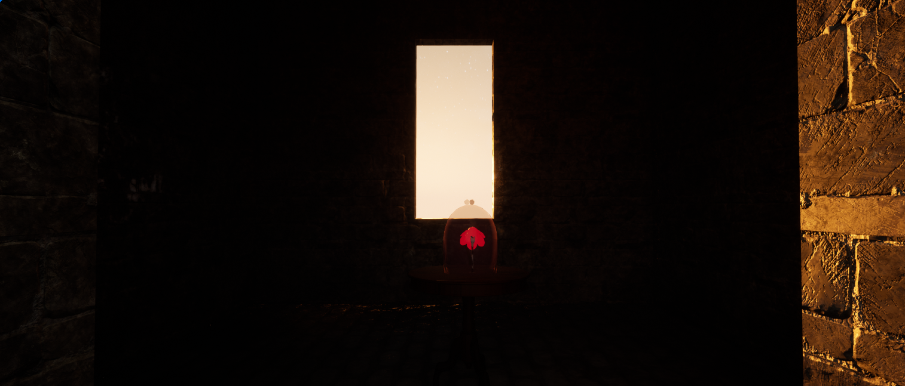
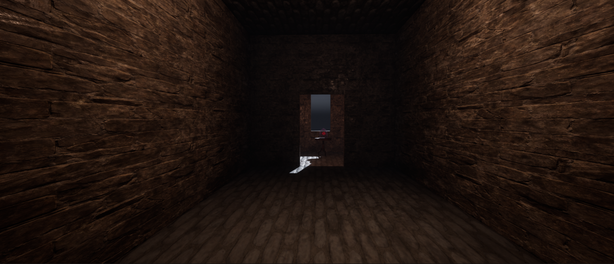
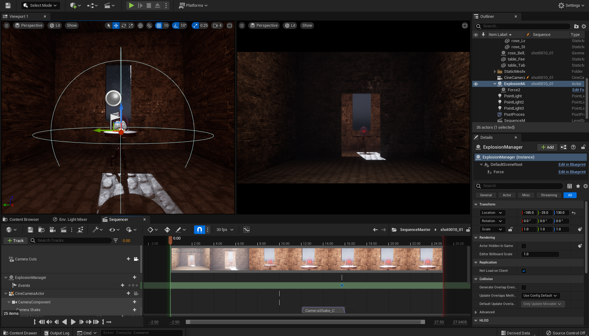
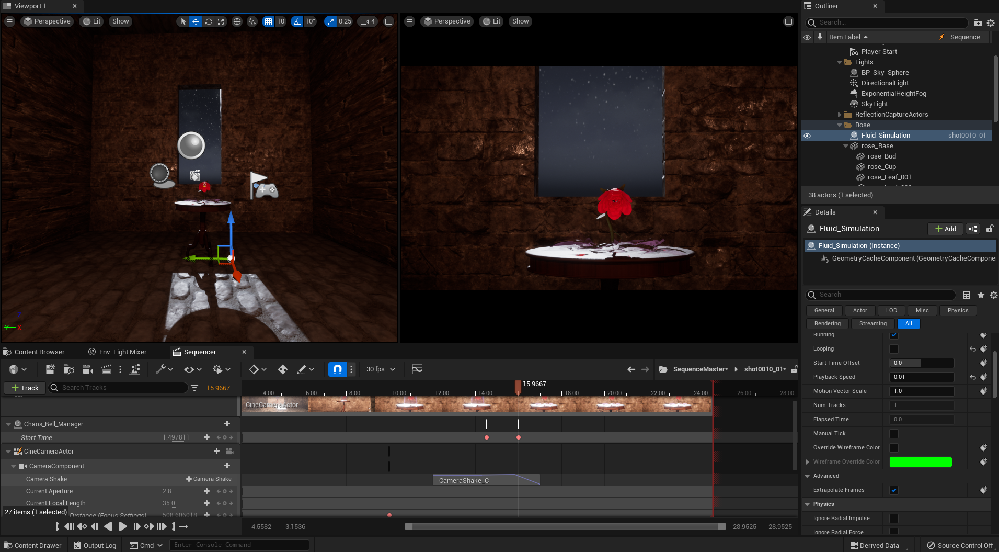
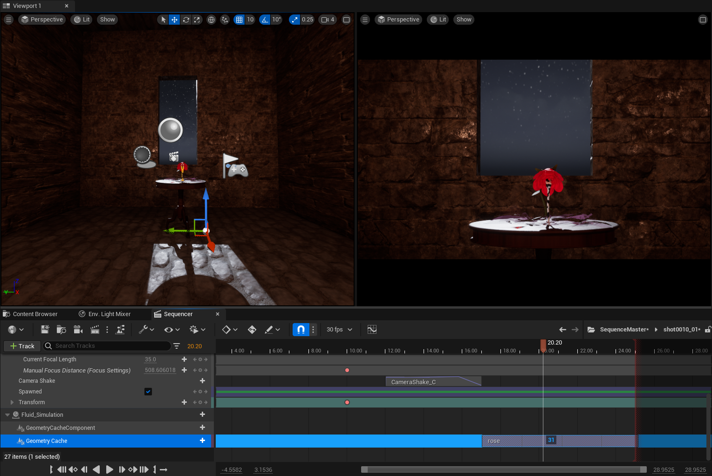

# Unreal Engine 5 Animation

This animation is using the same idea as the one I had for the still offline render. To remind you, this is a twisted version of *Beauty and the Beast*'s magical rose. Instead of trying to break the curse, the Beast embraces it and twists the magic of the witch that put the rose here. This ends up breaking the galss bell that was encasing the magic flower and corrupts the flower.

## Process

The process of making that video was much quicker than making the assets for the video.

### **Scene setup**

I prepared the assets in Blender by baking the textures I could and applying the necessary modifiers. This heavily simplified setting up the table and parts of the flower. I just had to export the objects to an FBX format and import them into Unreal. I also exported the fluid simulation as an Alembic file. This file type is supported by Unreal out of the box but I needed to scale the simulation by 100 because Alembic stores units rather than distances in meter and thus didn't have the right scale. Blender units are 1m and Unreal's are 1cm. Thankfully, Unreal allows you to set the scale through the import parameters. You don't need to think about it anymore once properly imported.  
I also used the assets that come with the default Unreal empty setup to make the outside scenery and the glass as they were better than the ones I made in Blender. I used the basic meshes you can find in Unreal's default project for things like the door and the window. Then, I applied to the floor and walls some materials that were in the defaults and that fit the castle aesthetic. I stretched the wall materials to try and make it feel elongated and much to my surprise it worked. For the glass, I modified the default glass material by adding some roughness and tint to it.  
Sadly, I couldn't get the volume scatter to look the way it did in Blender. This is most likely due to the difference in rendering engines. I don't have enough time to dive deep into this.

This first step took me about 1 day, 1 day and 1/2. The fbx file format makes the exporting and importing trivial. Importing the alembic file was just as easy.

### **Fluid simulation material**

As I wanted to reproduce an effect similar to the one I did in the offline render, I went with my idea of a screen space texture. Remaking the effect I wanted in Unreal's material editor was trivial as it is just noise and some maths applied using the camera coordinates. It gave the effect I was looking for after ~45 minutes of tinkering with it.

### **Lighting setup**

To make the lights the way I wanted, I chose not to import my setup from Blender. I figured that it would look very different because of the rendering engine change and that I could use the learning process in Unreal as well. In order to do this properly, I first spent some time watching [William Faucher's tutorials](https://www.youtube.com/watch?v=fSbBsXbjxPo) on lighting. This gave me a fairly good overview of how I could use Unreal's lighting system. Here are a few iterations:

  

I settled for a full moon lighting and a grey-ish night sky. I added 3 point lights to simulate torches and gave them a slight orange tint.  
Thanks to ray-tracing, the lighting and shadows look very smooth. I think it was quicker starting the lighting from scratch rather than importing than modifying a setup.

### **Camera and Sequencer setup**

Setting up the camera and the sequencer wasn't too hard. I added the camera to the sequencer, added a few keyframes and I already had the movement I needed. Unreal's auto ease-in ease-out animations for the keyframes made the movement smooth. Once that was done, I followed William Faucher's tutorial on camera shake and adapted it to what I needed. The only issue I have with the camera shake is a weird feeling that the glass bell is lagging behind when the camera is shaking. I don't know where this is coming from and couldn't figure it out after a whole day so I moved on to be able to finish on time. Here is a screenshot of the finished camera setup:

### **Destructible mesh and physics shenanigans**

This part is what gave me headaches. Because UE5 is quite recent, the docs and tutorials out there are not all updated to the latest features. One of the changes made was the way it handled destructible meshes. Those were small changes but significant enough that a newcomer would struggle with them. I planned on using a radial force to make the glass explode but after a full day of working on it, I couldn't get it to work. In order to test if the radial force was even doing anything in the engine, I put a cube with physics next to it. I didn't make the force very strong but it was enough to push the cube in the glass and break it. I realised I could just drop an invisible cube on the glass to break it.  

Before making the cube invisible, I tried to put the animation in the Sequencer. I managed to do so quite easily, using a geometry collection cache manager and player. The advantage of using the sequencer there is that I had to cache the animation in the manager and play it in the sequencer with the player. This meant I didn't even need to keep the cube or make it invisible. I just cached the breaking animation, put it in the sequencer and removed the cube. I then offsetted its start by putting a keyframe on the geometry collection player.

This wouldn't be the end of my struggle with the destructible meshes though. We will come back to this later. For now this results in the following:

### **Fluid simulation and geometry cache track**

Adding the geometry cache containing the fluid simulation to the sequencer was trivial. There is a very simple experimental feature called Geometry Cache Track that allows the user to simply drag and drop the geometry cache in the sequencer and play it when they want to. Sadly, considering it is experimental, I couldn't find any bug fixes or even bug reports. I spent some time trying to iron out as many bugs as I could but a couple glitches got into the final render sadly.

Despite the few bugs it still works quite well. Here is a screenshot of the result:

### **Render troubles**

Unreal used to have a cinematic capture built-in feature. It was fast to iterate with but didn't give incredible results when it comes to quality. I looked into how I should use the new system and activated the plugin that allows the user to record videos rather than sequences of images. This plugin didn't give me good results however, the compression was very lossy and confusing to setup. Thankfully, I know about a few tools that could help me process the results of Unreal's export. I used the default png sequence export to get all the frames as images then used FFMPEG to convert that into a video while controlling the compression. This allowed me to get a 720p video that weighs slightly more than 24Mb.

I also uploaded the video with a better quality to YouTube for ease of access. Click on the link to watch it:

[The Beast and Beauty](https://youtu.be/XCkLtAdPJbk)
