# Interactive assignment

## Premise

As a radical change from the two previous assignments, I didn't use the Beauty and the Beast theme. I felt like interacting with a static scene would be quite boring.

I happened to stumble onto Maxwell aka Dingus the cat on Youtube in [this video](https://www.youtube.com/watch?v=4jM13eQWAwA). For some reason, my broken brain found the video hilarious and I figured I'd base my concept around this. Introducing Dingus Party: Maxwell the cat is having a party on her luxurious sofa. On top of the low quality video available on this Github, you can find a YouTube version [here](https://youtu.be/i_VA94WPXkA).

## Process

### The building setup

To complete this assignment, we were given a template. This template contained some source code to load a very simple model into a window and display it. It also allowed to rotate the model. The first thing to use that template was compiling and running it. Dr. Padilla's advised method was to use Microsoft's VSCode to compile and run the program. During Lab 04, I managed to get the template to compile and run using VSCode, however, this process had some serious flows.

First was the set up. Visual Studio Code was hard to set up for this to work and quite a lot of people left the lab without having successfully compiled the template. This was due to several reasons, among them Windows, VSCode's setting system, the lab's computer compiler setup. Then, VSCode was always recompiling everything before launching. This combined to VSCode's inherent slowness makes iterating incredibly painful. Waiting for 30 seconds for everything to compile every time I am testing out something is not something I'm used to.

Thankfully, I have learned how to set up and use other building systems. I chose CMake to make my building system. CMake has massive advantages over VSCode. First, it caches the build files. That means it is only recompiling what has been changed. This reduces compile times drastically. Then, it is much faster to launch than VSCode and doesn't need you to look at the file containing the main function to build. This further decreases iteration time. Also, considering it is a cross-platform tool, you just need two different scripts to build for two different systems. Thanks to that, this project can be built and worked on on both Linux and Windows machines. Also, even though you can use CMake GUI, it is primarily a CLI. For someone used to UNIX systems and programming in general, this is much more efficient than clicking with your mouse on the right buttons. The last and best advantage CMake has is the outputting of errors. VSCode's log of errors is terrible and doesn't persist through iterations, this makes debugging very painful.

The biggest disadvantages of CMake is one of its best features: it is compiler independent. This means you have to set up your compiler yourself. Because of Microsoft's tendency to block every software that isn't their own, setting up your compiler to avoid using the overbloated Visual Studio Solution system can be tricky. However, on most Windows 10 machines, this is quite easy when you know what you are doing.

When I got my setup to work, I noticed that most of my cohort was still struggling to set up VSCode. This is why I asked Dr. Padilla if I could share my build system with them. I was granted permission and immediately got to work on a small tutorial to guide people through installing. The tutorial worked for most Windows 10 PCs. Software being software however, the tutorial didn't work for everyone. Unsurprisingly, Windows 11 machines were very hard to setup. The encountered difficulties were obscure and unique to each computer but with a bit of thinking and thanks to CMake's great documentation, we were able to sort out most people.

Safe to say this tutorial needs some improving. However, it turned out to be a very good alternative to VSCode for most students working on their own PCs and laptops. I would be glad to update the tutorial and get it out to next year's students as an alternative once this module is finished.

### The template

Once the template was compiling and running, I looked into how it worked. Barely having any knowledge about how to actually program with OpenGL made that very hard at first. I chose to ignore the template for the first few days and solely focused on learning about OpenGL. I did that following [LearnOpenGL's tutorial](https://www.learnopengl.com). Once I got through the basics, I tried to mess with the template a bit. I started by implementing very basic Phong lighting. That worked very well. I then tried switching the model but anything I put in there was messed up once it got loaded in. I suspected I failed exporting but any other renderer managed to load in and display the models I tried. I also used glTF samples from Khronos' samples directory and they got in even a worse shape than mine.

The only explanation was that the template wouldn't work for complex models. I was thus faced with a choice: make my models simpler so that the template accepts them or build upon the template and make it work with any model. I felt pretty confident in my ability to fix the template's issues and chose the second option. I devised a simple system that would ideally let me organise my program simply while being precise enough to be easy to implement.

These are UML and sequence diagrams explaining how the system I use works:

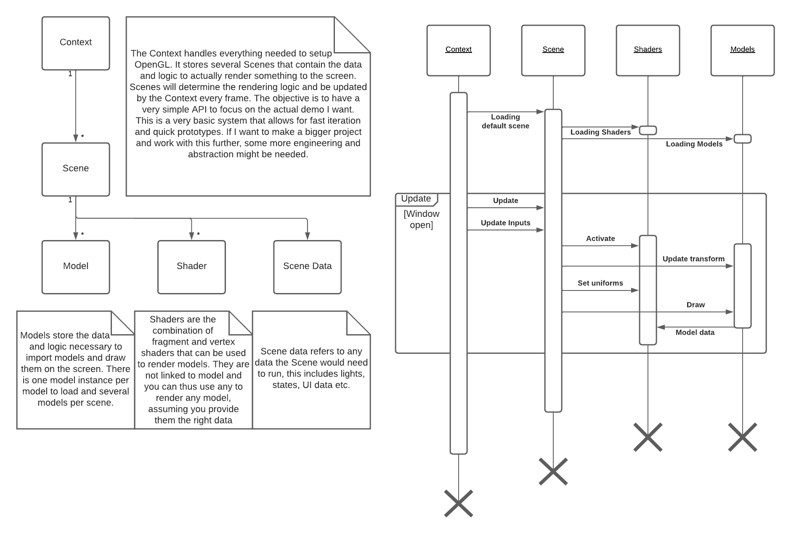

Implementing this system was fairly simple at first: the context and scene system just broke down the main function in several parts and abstracted away the OpenGL interfacing. The original template also had 2 main classes: Content and Pipeline. Content handled the model loading and Pipeline handled the shader program loading. Since I went through LearnOpenGL's tutorial, I made my own shader class to work with it more easily than the tutorial's or the template's would have allowed me to.

The easy part was done. I carried on to the Content class. At first it was unclear to me what the class was supposed to be but I quicly understood that it was in charge of loading and displaying the models from the glTF files containing them. In order to do that, it used tinygltf, a header only library made in order to map the glTF files' JSON structure to C++ data structures. The template was just the basic loader you can find on the library's Github. I understood that in order to fix the template, I needed to learn about that format and so I did. Thanks to the following handy cheatsheet from Khronos and the [glTF specification](https://registry.khronos.org/glTF/specs/2.0/glTF-2.0.html), I managed to understand what the template did poorly.

First, the template loaded the textures several times. Putting this in a function and out of the loops already made loading models quicker. Then, it was only using the first texture loaded. This could be the normals texture, the albedo, the metallic-roughness etc. However, to fix that, I needed to store the textures used and also figure out what they were and how to use them. To figure out what to do with the textures, I looked into the materials stored in the glTF file. Each material referred to the different textures and how it was using them. They also referred to which submeshes (also called primitives) they applied. This made me understand the biggest issue with the template. It only used a single VAO to handle every submesh and every material. By creating new VAOs for each submesh, I was able to apply the different materials to the different parts of the meshes and fix the display of the meshes at the same time. I had to modify both the loading and the draw functions to do that. With some basic parsing, it was easy to setup which textures would go into which samplers and thus display them on the models by using the shaders.

I also added a system to allow for models that didn't have every single texture. When I load the model, I specify a bit mask that is used to load or not the textures in the shaders. It also tells the shaders whether those textures are loaded or not so that it provides a default value if they're not. Ideally, this would be done by using #define statements and modifying the shader code on the fly, but such a system was too long to implement.

Here are screenshots of the Model class and Shader class declaration, replacing the Content and Pipeline class:

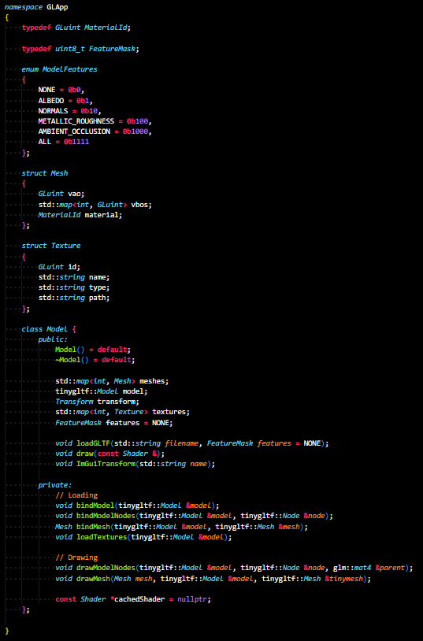
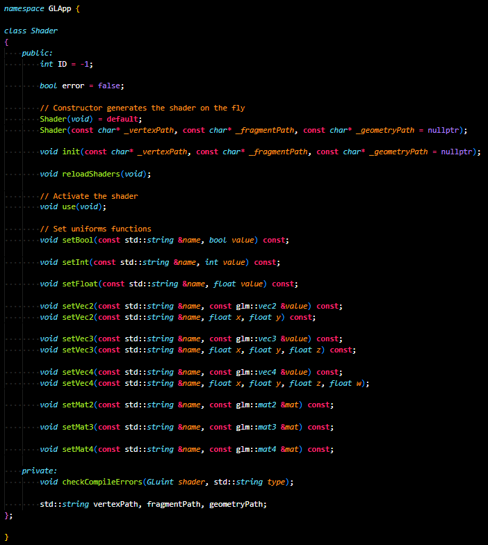

### The fun stuff

I started by recreating the meme that gave me the idea:

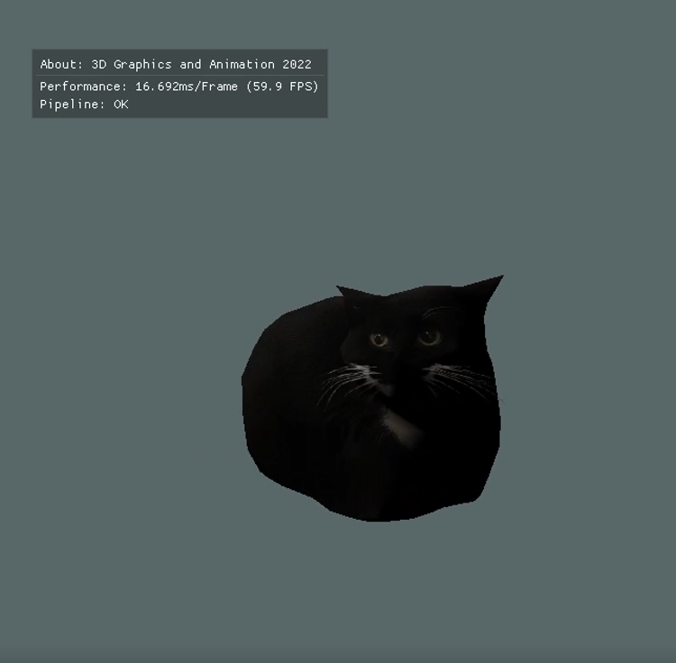
(A very short video of said meme is in the images folder)

With the models loading properly, I worked on the shaders. Since we had all the textures loaded properly for the normals, roughness and ambient occlusion, I figured I'd try and implement PBR. Following LearnOpenGL again, I was able to figure out how to. My models weren't good examples to show off this rendering technique however. In order to properly show this off, I used Khronos' [sample models](https://github.com/KhronosGroup/glTF-Sample-Models). I chose the damaged helmet and the glam velvet sofa. The damaged helmet is great to show off the PBR but would look even better if I went deeper into this and implemented emission and reflections. The sofa, while not showing off the PBR, fits the scene and also uses the partial features system I implemented earlier. I also used the model for Maxwell the cat and created a special unlit shader for it (this model was on [Sketchfab here](https://sketchfab.com/3d-models/dingus-the-cat-2ca7f3c1957847d6a145fc35de9046b0)). Here are screenshots of an early test and of the PBR code:

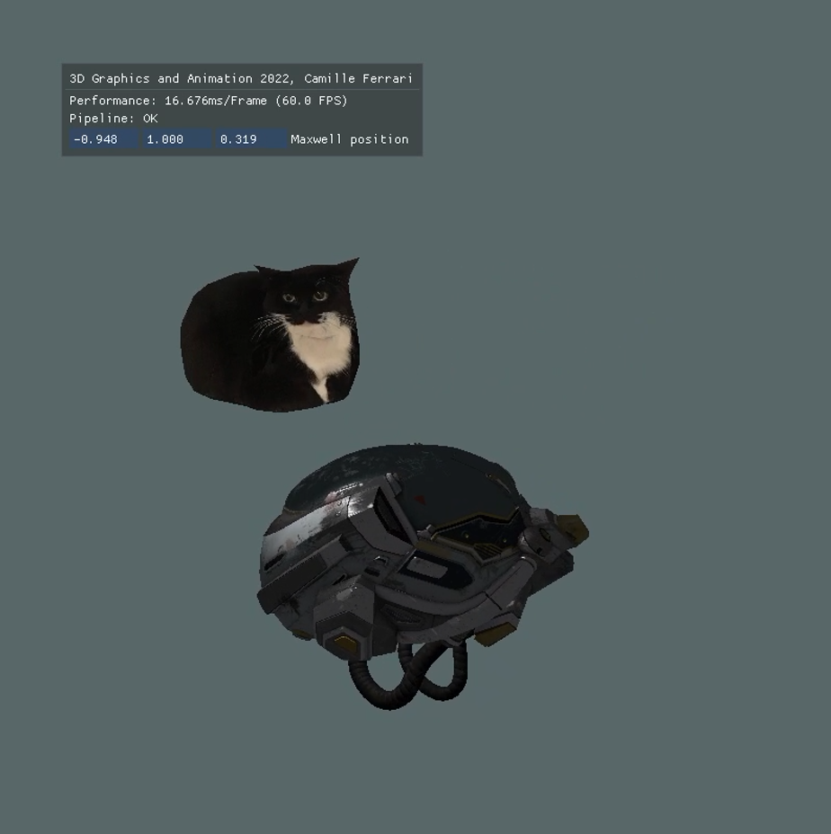

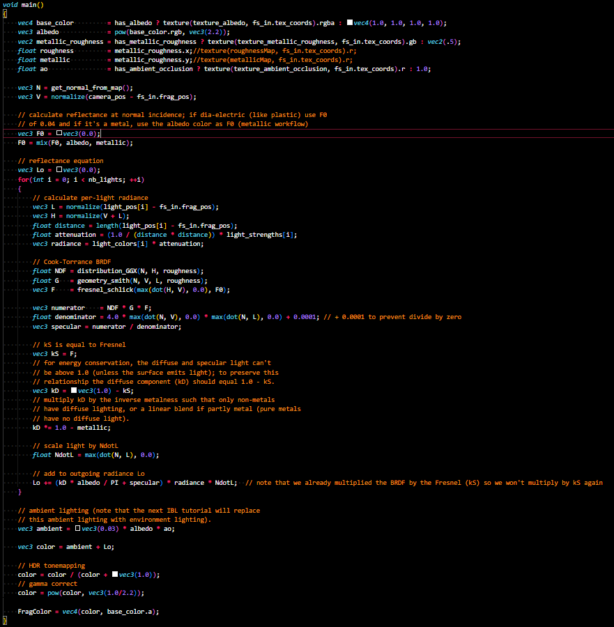

Once I was happy with that, I went on and created the floor. I thought of 80's carpets in nightclubs that were made up of blobs and forms of different colors. I had the idea of layering several stepped noise textures to achieve a similar effect. I was also influenced by Super Mario Galaxy's water textures layering and tried to give a similar feeling. This is the first noise layer test:

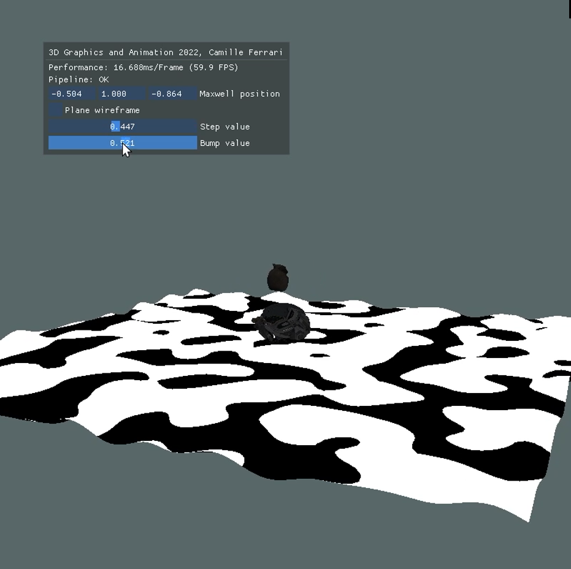

The first issue I noticed is that despite having vertex displacement, the absence of shadows prevented proper depth perception. The wireframe view confirmed this:

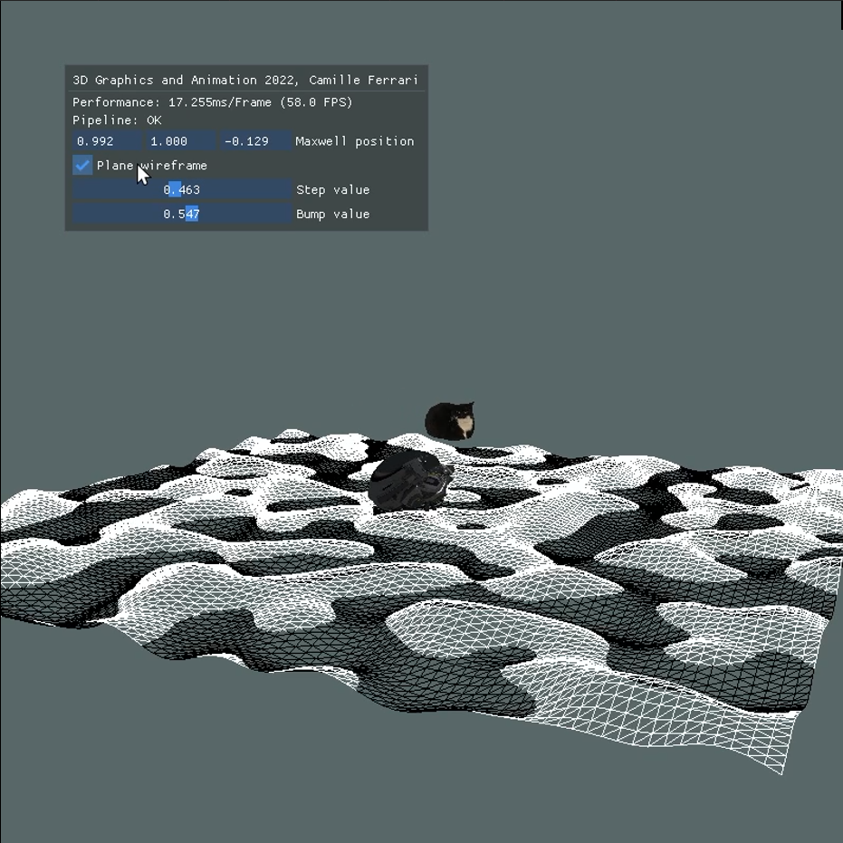

To fix that issue, I intensified the colors according to the dot product between the camera and the normal of the terrain. I had to recalculate the normals in the fragment shader to avoid blocky artefacts because the plane's mesh wasn't subdivided enough. Before that, I figured out how to have different layers and I gave them colors. Here is a screenshot of the colors before the fix and a screenshot of the program after the fix:

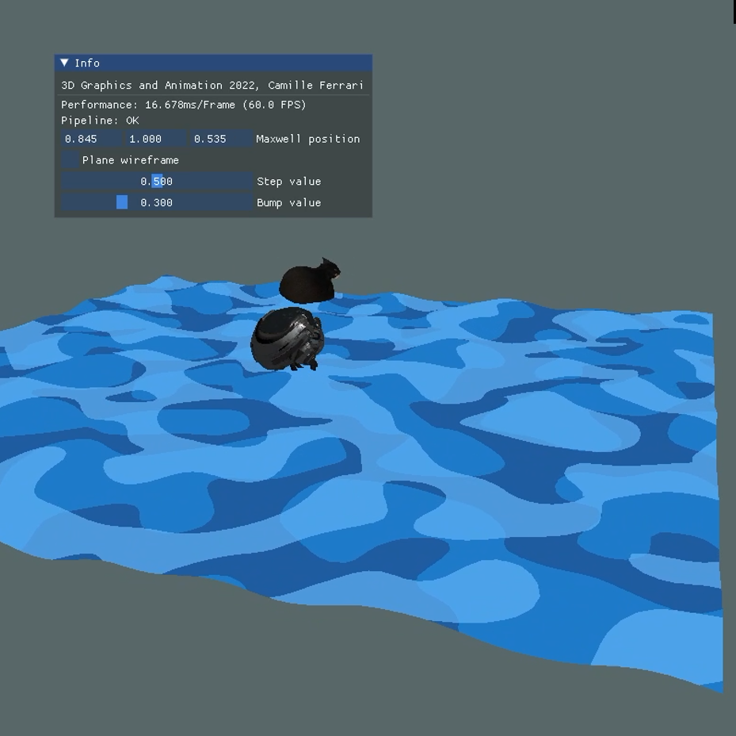

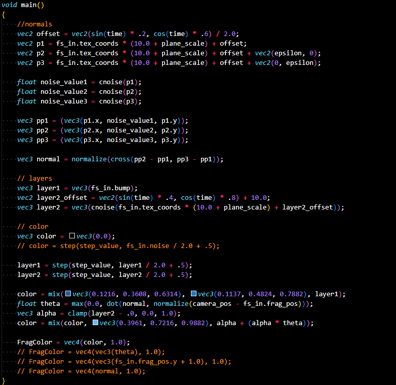

Once I was satisfied with the plane, I added some lights, animated them using sines and cosines over time and moved on to the framebuffer effects. The first effect I did was a color compression effect. By using a simple computation over the grayscaled value of the image and then multiplying the result by the image's color, you get a PS1 style render. I then made a grayscale effect as it was easy as well.  
Another easy effect is color abberation, by sampling the red or green component of nearby pixels and using it as the current pixel's, you get a very common color aberration effect. Scaling the effect by the distance to the center of the image then gives a very common psychedelic effect used in cinema.  
The last and most complicated effect is noise-based dithering. Basing myself on the dithering from [this shadertoy](https://www.shadertoy.com/view/MslGR8), I adapted it so that it would scale from the center and be multiplied by a colour, giving an "old film" appearance.

The last thing I implemented was technically a post processing effect, but it is present on every other as well. I forwarded the depth buffer to the post processing framebuffer in order to isolate the background of the rendering. I then applied a voronoi texture to it and remultiplied it by the base color. This allowed for a nicer background.

The demo for the final product is in the project but also available on YouTube [here](https://youtu.be/i_VA94WPXkA) for better quality.

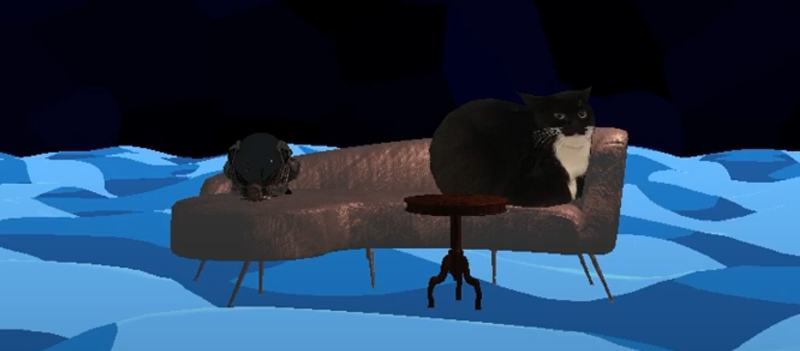

## Conclusions

Despite the rocky start, this project was very fun. I am very glad I had the C++ knowledge necessary to undertake it and focus on the OpenGL part. I had been wanting to learn more about shaders and this was the perfect opportunity. There are things I would do differently and modify however. The Scene and Model class could be refactored and I could add lots of framebuffer effects. Also, supporting every feature from glTF would be very interesting, things like emission or vertex colours.
