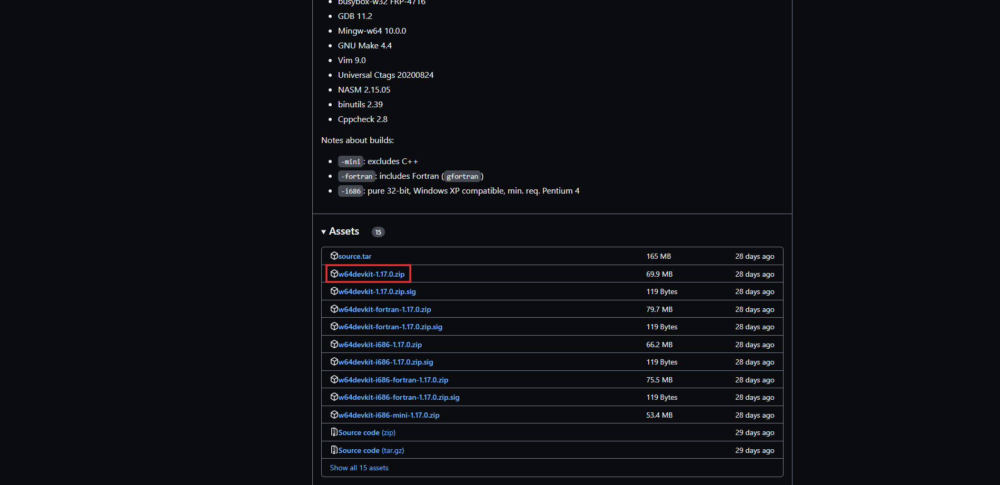
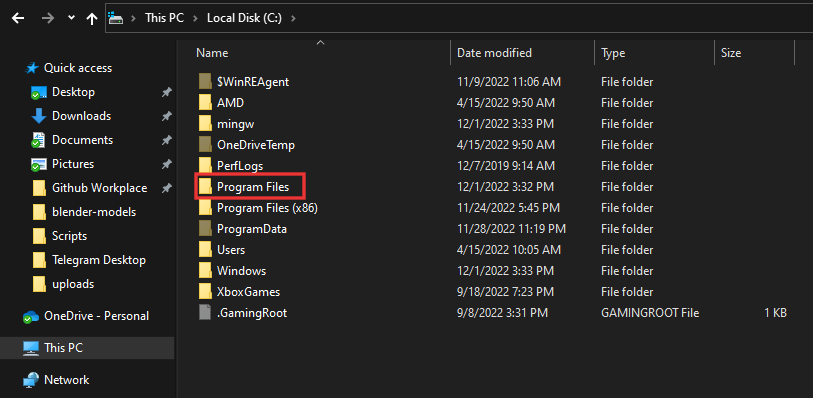
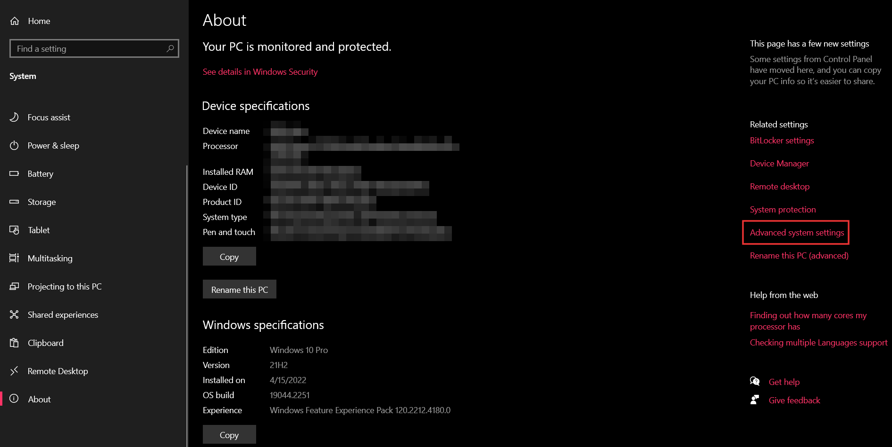
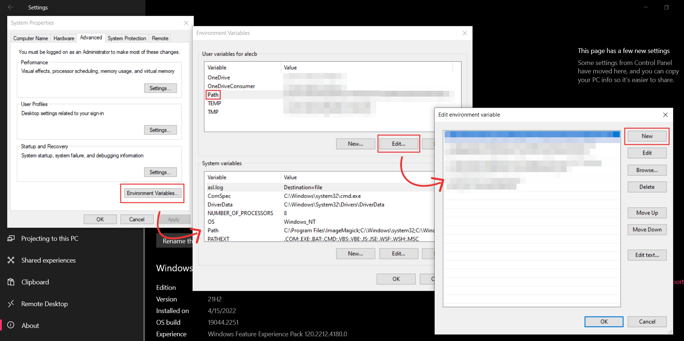
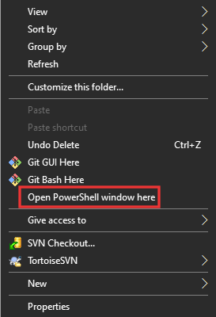
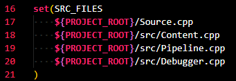

# Building process

This build system is based on CMake, MinGW and MinGW Makefile. You will be installing MinGW with the extension built into it as well as CMake.

**This hasn't been tested on the lab's machines and probably won't work on there. I made this for your own personal computers.**

This tutorial assumes you don't have MinGW installed, if you do, I recommend uninstalling and following this tutorial to make sure everything goes right. I will update this tutorial to add a version that avoids uninstalling.

## Setting up everything

C++ is a compiled programming language. That means that there are 3 steps required to actually run a program made with C++. The first one is writing the program, this is your job as a programmer. The second one is compiling the program, this is the job of the compiler, another program. The third one is executing the output of the compiler, this is what your users will do and what you will do to test your program.

The build system described here takes care of the second part. It takes the program you've written and compiles it to an executable (I'll explain exactly what that is later on).

This means the first step you need to do is install a compiler. Thankfully, this is pretty straightforward. You need to go to [this page](https://github.com/skeeto/w64devkit/releases) and download the file named w64devkit-x.xx.x.zip (x being the version numbers, at the time of this writing, 1.17.0).

Once you have this downloaded, extract the folder from the zip archive. It should be named w64devkit. Once you've extracted it, move it to `C:\Program Files` (from the file explorer: `This PC > Local Drive (C:) > Program Files`).

Congrats, the files are now in the right place! Now we need to tell the computer that there is something installed there. This is done simply by changing something called an environment variable. Don't worry, you just need to follow the next few steps:

- Open the Windows Settings
- Go to `System > About` (you might need to scroll down to see it)
- There should be a `Related Settings` section on the right in Windows 10 and a `Related pages` section in Windows 11 (not on the right but on the page)
- In that section, click on `Advanced System Settings`
- In the small pop-up that opened, click on `Environment Variables ...`
- In the list on top of the new pop-up, select the variable called `Path` and click Edit
- On the new pop-up (this is the last one sorry), click on `New`, type in `C:\Program Files\w64devkit\bin` and hit Enter.
- Close all the pop-ups by clicking OK on each one

  

Voilà, you've installed a compiler that we can use!

Now, you are going to need one more thing, the building system itself. We will be using something called CMake.  
Download the installer by clicking this link: [CMake Installer](https://github.com/Kitware/CMake/releases/download/v3.25.1/cmake-3.25.1-windows-x86_64.msi)  
If the download doesn't work, stop using Microsoft Edge as your default web browser (it's rubbish) and go to `Windows Settings > Apps > Default Apps` to change that to Firefox or Chrome.

Execute the CMake installer. At some point, the installer will prompt you to choose between three options, "Do not add CMake to PATH", "Add CMake to PATH for all users", "Add CMake to PATH for current user". Choose the second one, you need CMake in the PATH, just like you needed the w64devkit in it earlier.

Dr. Padilla's template contains two versions, the Windows verion or the mac one. We are using the Windows one here. The inside of the Windows folder of the template should be put in the *Interactive* folder of your Github repository. You do not need anything else from the github zip you downloaded.

Once you have all the files there, transfer the following files from the tutorial to the same folder:

- .gitignore
- build.bat
- clean.bat
- CMakeLists.txt
- run.bat

## Building the damn thing

There are now two ways you can work with that build system:

- The right and intended way, easy, standard, that requires using a terminal
- The wrong, tedious and impractical way, that doesn't use a terminal.

Even though I made sure this was possible without a terminal, you'd lose all the warnings and the errors that are paramount when programming and debugging in C++. So let's learn about terminals!

To open a new terminal in the right place, navigate to the *Interactive* folder in your repository, through the file explorer. Then, hold down the SHIFT key and Right Click. Select the "Open PowerShell window here" option. If you are using Windows 11, use the "Open a terminal" option.

A terminal is very simple: you type in commands, hit enter, it executes the command. When you open a terminal, the line you type on is called a prompt. PowerShell's prompt contains the current working directory, simply put, it's the folder you are in right now. You can confirm that by typing in `ls` and hitting Enter. The `ls` command *lists* the files and folders of the current folder. If you compare the list with the file explorer, you'll see that it is the same.

Now that you know what a command is, let's introduce executables. Executables are files that your computer can execute. Essentially, they **are** the apps that you execute daily. Some of them are big, some of them are small, some of them can work on their own, others need additional files. In our context, we want to create an executable by compiling our program. I included 3 executables (these specific ones are also called scripts because they are series of commands). `build.bat` builds the program (aka compiles it), `run.bat` builds then runs the program (running a program means executing it), `clean.bat` deletes the build files and the executable (effectively "cleaning up" the folder).

To run an executable inside the terminal, you need to type `.\name_of_executable` then hit Enter, e.g. `.\build.bat` or `.\3DGraphics.exe`. Your workflow will look like follows:

1. Modifying the program files
2. Running `.\build.bat`
3. If there are any errors, going back to 1. and fixing them
4. Running `.\3DGraphics.exe` and testing if everything goes right
5. Loop around to 1.

The reason we use the terminal is because it allows us to see the errors that the building system and the program return waaaaaaaaaaaaay better than VSCode or Visual Studio would allow. The building system is also much faster and much more efficient than the aforementioned IDEs. It only recompiles what is necessary, drastically reducing times between iterations when writing a program. Also, knowing how to use a terminal is incredibly important as a developer and can improve your workflow tremendously.

Last but not least, we need to look at the `CMakeLists.txt` file. This file contains the configuration of the building system. It sets a bunch of variables telling the system how to work. It is akin to a script as it contains a series of instructions setting variables. One of the instruction you'll need to know about starts at line 16. This instruction `set`s the `SRC_FILES` variable. Source files (thus the name `SRC_FILES`, `src` usually means source) are the files containing the lines you wrote to make your program. You can see in the list inside the command that I have already included the files that Stefano created for his project. The `${PROJECT_ROOT}` variable just means "folder where the CMakeLists.txt file is" in that specific context.

Every time you create a new .cpp file, you should add a new line in that command. That will tell the building system that we want to include the file in the compilation. For example, if I created a `Test.cpp` file in the src/ folder, you would add the line `${PROJECT_ROOT}/src/Test.cpp`.

You now have everything setup to start working on your OpenGL project. If you are struggling to understand the code that the template contains, I highly recommend that you check out [LearnOpenGL](https://learnopengl.com/Getting-started/OpenGL).
