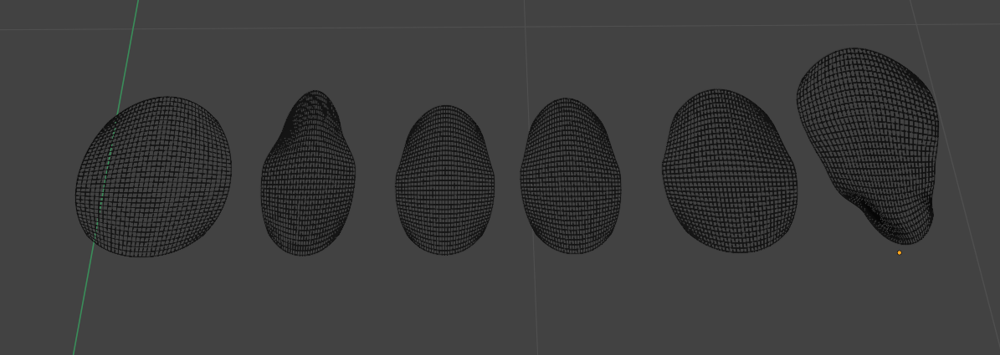
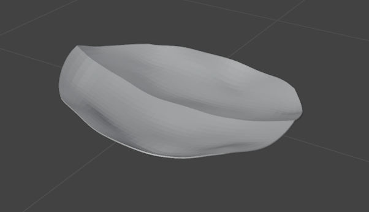
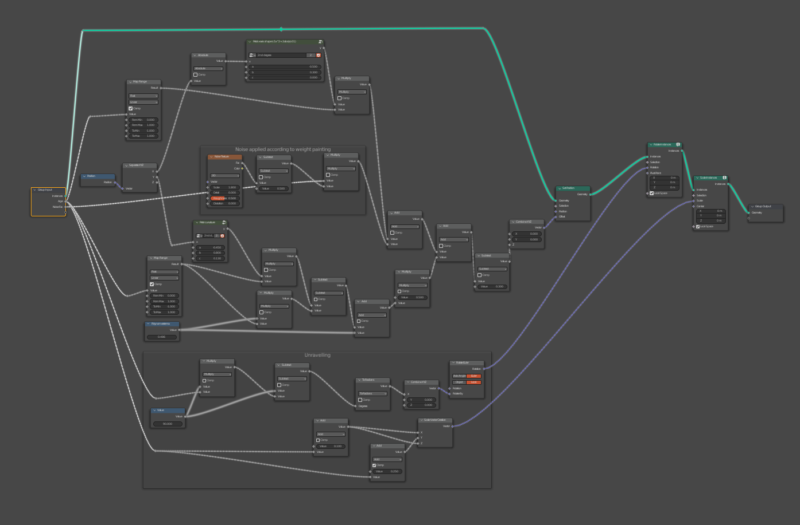
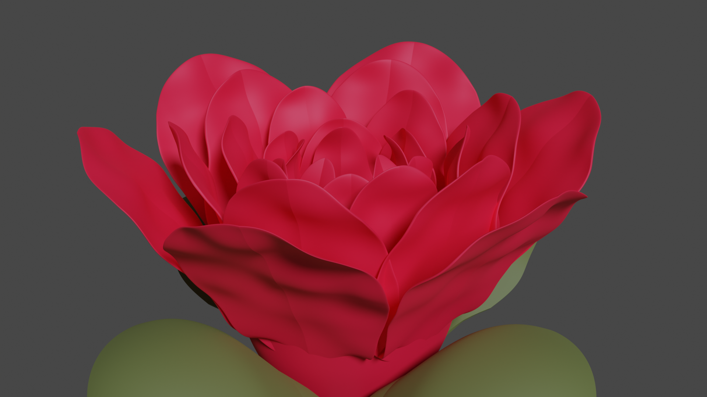
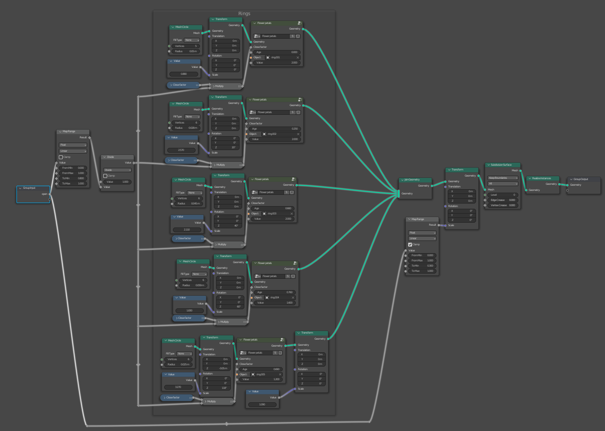
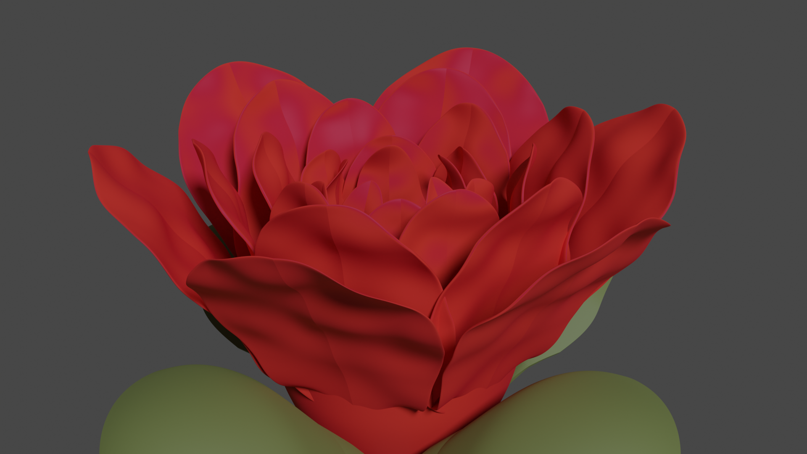
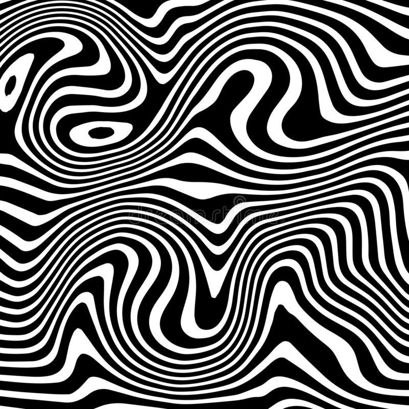
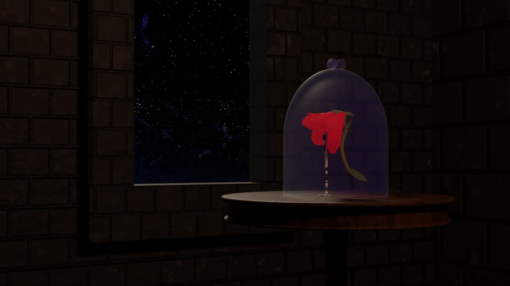

# Offline render

This project took about 2 weeks of work to iterate through and produce. It was spread over slightly more than 3 weeks.

## The idea

This creation wasn't at first motivated by the 3D graphics assignment. Originally, it was supposed to be used as a reference for a tattoo.  
The flower symbolises blooming. It's about growing up and becoming yourself. The fluid oozing out shows how this process can be weird and have unexpected results.
The goal was to have this contrast between something familiar and unsettling without losing beauty. It shows that weird and familiar can coexist in making something beautiful.

This wouldn't fit the theme of the assignment however. By adding a glass bell and some scenery however, I made the scene into a twisted version of *Beauty and the Beast*'s magical rose. Let's imagine how the rose would evolve if the Beast chose to stay this way, didn't care to look for love's true kiss and didn't change. The curse would be twisted in its purpose. The Beast would slowly corrupt it by exploiting his new terrifying strength. That corruption would manifest in the fluid slowly coming out of the flower.

## The process

I divided the project into several parts to separately model everything and then combine the elements in the scene.

### **The rose's flower**

The first element I started working is a petal for the flower. I am very fond of a feature called *Geometry Nodes* in Blender. This feature allows the user to apply procedural effects to the geometry of their models. These effects range from vector displacement to distributing geometry on the faces of the mesh. It goes without saying it is very powerful. I figured since I knew the basics of the tool, I might as well learn more and master it.

My process for the petals was rather simple: I would create a plane that has the right shape for a flat petal, subdivide it, then apply some displacement to the plane's vertices to curve it and randomise it. Creating the plane then applying noise to is was pretty straightforward thanks to the geometry nodes tool. The harder part came when I needed to curve the petals the right way. In order to understand that process better, I took botanical references about the development of rose petals. I then approximated the shape and the evolution of the shape through 2 parametric curves (one displacing the Z coordinate according to the X coordinate, the other according to the Y coordinate). Once i got the right shape, I built it inside the geometry nodes and exposed the parameters so I could tweak the result.

  
^ Examples of unprocessed petals

  
^ Example of processed petal

  
^ Geometry nodes layout for petal creation

This geometry nodes modifier also allows control over the "age" of the petal. This is done through two parameters to approximate the life cycle of a petal. The modifier will modify the displacement curves dynamically and rotate the petals. Simplified, you can modify how open the petal is and how small it is. The same modifier can thus be used for any petal similarly.

Looking back on that modifier, making it again would allow lesser complexity and better control over the mathematical curves. When I made it, I wasn't aware of certain subtilities about instancing in Blender or of certain features that could have helped me. I am glad I went through this process though, as it is helping me learn more about Blender.

Once I got the petals looking right, I used geometry nodes again to project them on rings of varying resolutions and sizes. I then control the "age" parameters of each ring in order to create the actual flower layout. I made 5 rings and adapted the base model for each (as shown earlier). Fiddling with that a while gave me the right model. I added a "cup" below the flowers to hide the fact that they do not touch each other and pretend bud leaves. Once that was done, I headed to the shading tab and made a very simple, one color, rough material. After setting up the GPU and realising the render shouldn't be in 8K, I finally rendered my first image:

Here is the geometry nodes layout creating the flower:

The material looked pretty bad but that was an encouraging first step and I was satisfied with those first few models.

I spent a few hours messing with the velvet shader because I thought this would allow me to approximate the feel and texture of a flower. A simple mix between the principled BSDF and the velvet shader gave these results:

I sadly couldn't get anything satisfying and chose to continue on and think about it later.

### **Basic stem and leaves**

I quickly whipped up a stem using a Bézier curve and a curve profile, repurposed the petal creator into a leaf creator, adjusted the results and went on with the rest.  
I will come back on those elements much as their purpose here was just to give some scenery.

### **Fluid simulation using Mantaflow**

This part was one of the most challenging for several reasons. First, I had never used Blender's Mantaflow tool for fluid simulations; the first time using a tool is always the hardest. Then, since Blender is not specialised in simulations, their fluid simulations only run on the CPU, making them particularly slow to iterate with. Also, the mesh of the flower (it affected the simulation) was quite complex and thus slowed down the simulation even more.
It was usable however and after using the tool for about a day I managed to get the right settings for the simulation, bake it and start working on how it looked.

Blender allows us to apply any kind of material onto the mesh created by the fluid, making it quite easy to realise the vision I had in mind. I wanted the fluid to have a screenspace texture of a liquify pattern. Liquify is a tool used in image editing to affect an image with spirals, twisting it around a point. It allows for very interesting patterns such as these:

My goal was to use a texture like that and put it in screenspace on the fluid. Screenspace means that the fluid acts like a window on the texture that would be behind the image. It's commonly used to make nice space effects in video games. Here is an example:

[Source](https://realtimevfx.com/t/screen-space-cosmic-shader-breakdown-unity-ase-shaders-textures-included/9753)

Here is the first try using a static texture:

The result is quite disappointing. The texture doesn't loop properly and isn't as contrasted as I hoped. I figured I might as well try another method.

The method I had in mind was using a step function on a perlin smooth noise. By multiplying the smooth noise by a constant, than taking the decimal part of the result, I would get several "wave-y" patterns quite similar to the liquify effect I was looking for. One thing I noticed is that the liquid being rather thin, you only realised the texture was in screenspace when moving around. Having the fluid shaded also slightly removes that effect. I didn't mind that as I plan to animate it at some point anyway and the result still looks great.

Here is the first result:

I then messed around with colours and transparency but couldn't achieve a more satisfying result than my original idea. This was very interesting though, as it helped me understand more how alpha works in materials.

Enjoy some iterations:

I ended up going back to my first idea of black and white patterns.

### **Stem, thorns and leaves**

I modelled a simple small thorn for which I made a simple material using stretched noise and a gradient on a base color then distributed it on the stem using a simple geometry node (Distribute points on faces > Instances on points + a couple of modifications).  
I also made a material for the leaves using a voronoi pattern and mixing between two colours with it.  
Finally, I used a stretched noise on the stem itself to give it roughness.

  
^ Thorns modelled, shaded and distributed

  
^ Stem and leaves material implemented

Overall, the results are not fantastic, approaching realism being very hard. It doesn't matter too much however as I didn't plan on having the focus be on the stem.

Here are the render steps:

<!--  -->
<!--  -->
<!--  -->
<!--  -->
<!--  -->
<!--  -->
<!--  -->
<!--  -->
<!--  -->
<!--  -->
<!--  -->

